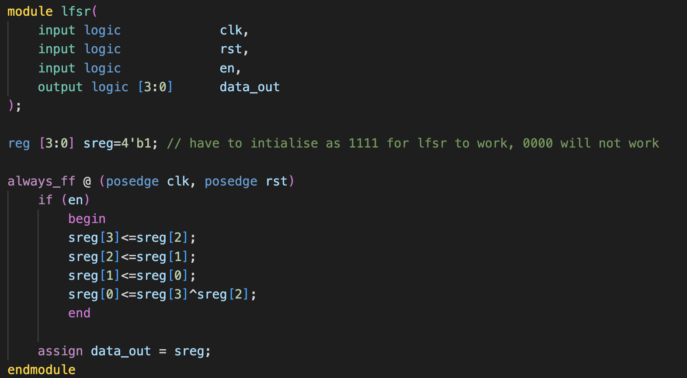
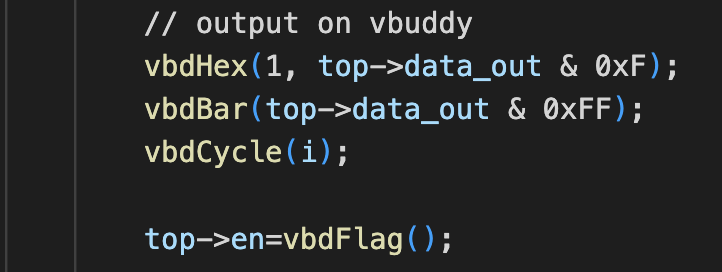

<center>

## EIE2 Instruction Set Architecture & Compiler (IAC)

---
## Lab 3 - Finite State Machines (FSM)

**Shermaine Ang**

---

</center>

## Objectives
By the end of this experiment, you should be able to:
* design and test a PRBS generator using a linear feedback shift register (LFSR)
* display 8-bit value on neopixel bar on Vbuddy
* specify a FSM in SystemVerilog
* design a FSM to cycle through the Formula 1 starting light sequence
* understand how the **_clktick.sv_** module works, and calibrate it for 1 sec tick period
* automatically cycle through F1 lights at 1 second interval
* optionally implement the full F1 starting light machine and test your reaction.

## Task 1 - 4-bit LFSR and Pseudo Random Binary Sequence
---

**Step 1 - create the component lfsr.sv**

Open the _Lab3-FSM_ folder in VS code. In folder **_task1_**, create the component **__lfsr.sv__** guided by Lecture 4 slide 14. Modify the version in the lecture notes to include an extra enable signal **_en_**, and all four bits of the shift register output are brought out as data_out[3:0].  This is your top-level circuit for this task.

<p align="center">  </p>

My Code:
<p align="center">  </p>

Line 8 was added as it has to start with a number as the bits will have to be reassigned. Using 0000 did not work as reassigning will just cause it stay at 0000, hence 1111 was used instead.

Using **if (en)** resulted in the number only changing when the button was pressed.

**Step 2 - Create the testbench for the LFSR**

Create a testbench to test this 4-bit random number generator.  In your testbench you should use the Vbuddy rotary encoder switch (EC11) and the **_vbdFlag()_** function in one-shot mode (i.e. using **_vbdSetMode(1)_**) to drive the **_en_** signal to step through the random sequence each time you press the switch on Vbuddy.

The four bit output of the random sequence can be shown on the 7-segment display using the **_vbdHex( )_** function as:
```C++
      vbdHex(1, top->data_out & 0xF);
```
Furthermore, you should also display this 4-bit result on the neopixel strip using the **_vdbBar( )_** function:
```C++
      vbdBar(top->data_out & 0xFF);
```
Note that **_vbdBar()_** takes an unsigned 8-bit integer parameter between the value 0 and 255. Therefore you must mask _data_out_ with 0xFF.

My code:
<p align="center">  </p>

**Step 3 - Create the doit.sh script**

Modify the doit.sh file from Lab 2 so that the name of the Device-Under-Test (DUT) is now _lsfr_.  Build your simulation model and test your design.

___

<p align="center">TEST YOURSELF CHALLENGE </p>

___

Based on the **_primitive polynomial_** table in Lecture 4 slide 16, modify **_lfsr.sv_** into a 7-bit (instead of 4-bit) PRBS generator. Test your design.  The 7th order primitive polynomial is:

<p align="center">  </p>

Changed the 4 bits to 7 bits. 
Problem: vbdHex() only shows one digit on the display. With 7 bits, value will be more than 1 digit long, not sure how to change code to accomodate that. 

## Task 2 - Formula 1 Light Sequence
---

Formula 1 (F1) racing has starting light consists of a series of red lights that turn ON one by one, until all lights are ON. Then all of them turn OFF simultaneously after a random delay.

The goal of this task is to design a FSM that cycles through the sequence according to the following FSM:

<p align="center">  </p>

Based on the notes from Lecture 5, implement this state machine in SystemVerilog to drive the neopixel bar and cycle through the F1 light sequence.  You should use the switch on the rotary switch with the **_vbdFlag()_** function (in mode 1) to drive the _en_ signal as shown below:

<p align="center">  </p>

Write the testbench **_f1_fsm_tb.cpp_**. Compile and test your design.  Each time you press the switch, you should step through the FSM and cycle through the F1 light sequence.

Problems encountered:
I did not add in a parameter WIDTH line, and hence the output was only 1 bit long. 
I needed to make it clear that the output is 8 bits long, so that all the lights will light up!
---